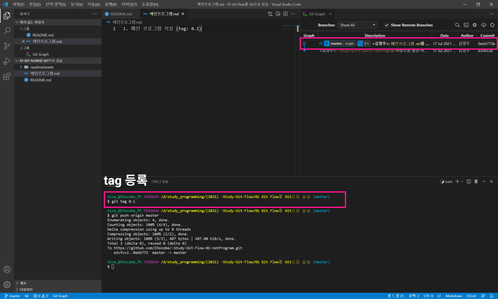
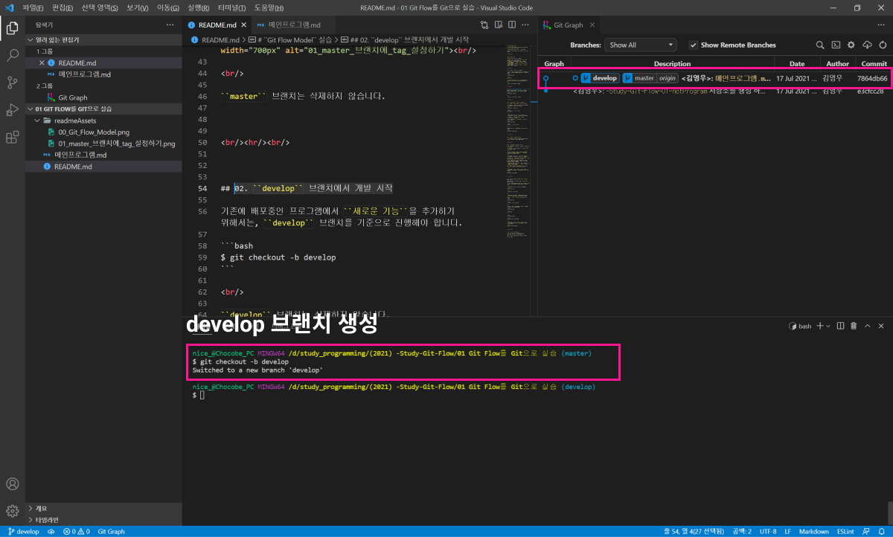

# ``Git Flow Model`` 실습

<br/>

``Vincent Driessen``님의 ``Branch`` 관리 방법 입니다.

``Branch``별 역할을 정의하여, 체계적인 버전관리를 위한 방법 입니다.


<br/><hr/><br/>


## 00. ``Branch`` 종류

``Branch``는 크게 다음과 같이 구성합니다.

* ``master``: 모든 검증이 완료된, ``배포`` 전용 ``Branch`` 입니다. (``tag``를 함께 명시 합니다)
* ``develop``: 개발의 중심이 되는 ``Branch`` 입니다.
* ``feature/기능명``: ``특정기능``을 ``신규개발``하기위한 ``Branch`` 입니다.
* ``release/버전``: 배포하기 전, ``배포 최종 준비``를 위한 ``Branch`` 입니다.
* ``hotfix/버전``: 현재 배포중인 ``master``를 ``긴급수정`` 하기위한 ``Branch`` 입니다.


<br/><hr/><br/>


## 01. ``master`` 브랜치에 ``tag`` 설정하기

만약, 현재 ``master`` 브랜치가 ``배포`` 상태라고 가정하면, 현재 ``master`` 브랜치에는 배포버전에 해당하는 ``tag``를 설정해야 합니다.

```bash
$ git checkout master
```

```bash
$ git tag 0.1
```

<br/>

<br/>

``master`` 브랜치는 삭제하지 않습니다.


<br/><hr/><br/>


## 02. ``develop`` 브랜치에서 개발 시작

기존에 배포중인 프로그램에서 ``새로운 기능``을 추가히기 위해서는, ``develop`` 브랜치를 기준으로 진행해야 합니다.

```bash
$ git checkout -b develop
```

<br/>

<br/>

``develop`` 브랜치는 삭제하지 않습니다.


<br/><hr/><br/>


## 03. ``feature/기능명`` 브랜치에서 ``신규 기능개발``

개발할 기능별로 ``feature/기능명`` 브랜치에서 개발합니다.

``feature/기능명`` 브랜치는 ``develop`` 브랜치에서 분기하며, 개발이 완료되면 ``develop``에 병합 됩니다.

```bash
$ git checkout -b feature/short
```

```bash
// "feature/short" 개발 후, "Commit"
$ git commit
```

<br/>

``feature/기능명``에서 목표했던 개발이 완료 되었다면, ``Commit``을 하고, 해당 내영은 ``develop``에 병합 시킵니다.

이 때 중요한 것은, ``No Fast Foward`` 로 병합해서 ``병합내역``을 남겨야 합니다.

이유는, 병합이 완료되면, ``feature/기능명`` 브랜치는 삭제할 것이기 때문입니다.

```bash
$ git checkout develop
```

```bash
$ git merge --no-ff feature/short
```

<br/>

병합을 완료 하였으면, ``feature/기능명`` 브랜치는 ``삭제`` 합니다.

```bash
$ git branch -d feature/short
```


<br/><hr/><br/>


## 04. ``develop`` 브랜치에서의 ``수정``

만약 ``신규기능``을 병합한 후, 그 기능에서 버그나 수정사항이 발생하면, ``develop`` 브랜치에서 수정을 합니다.


<br/><hr/><br/>


## 05. ``release/버전`` 브랜치에서 ``배포준비``

현재는 ``신규기능``이 개발완료 되어 ``develop`` 브랜치에 병합이 된 상태입니다.

이제 배포를 위한 준비를 해야 하는데, 이 때 사용하는 브랜치가 ``release/버전`` 입니다.

<br/>

이 브랜치는 ``develop`` 브랜치에서 ``분기``되며, 여기서도 발견되는 새로운 ``버그``나 ``수정사항``은 ``release/버전`` 브랜치에서 바로 수정작업을 합니다.

<br/>

``release/버전`` 브랜치에서 모든 ``버그`` 또는 ``수정사항``이 완료 되었다면, 배포 브랜치인 ``master``에 병합 시킵니다.

여기서 중요한 점은 ``release/버전``에서 발생한 수정사항은, 매번 ``develop``에 다시 ``병합`` 시켜주어야 합니다.

이유는 ``release/버전`` 브랜치는 ``배포직전`` 브랜치이기 때문에, ``develop`` 브랜치에도 그대로 반영이 되어야 최종배포 상태가 반영될 수 있기 때문입니다.

``release/버전``에서 발생한 여러가지 ``commit`` 내역 중, 마지막 ``commit``은 ``develop``에 병합할 때 ``--no-ff``를 사용하여 ``병합내역``을 남겨야 합니다.

또한 ``master`` 브랜치에 ``release/버전``을 병합할 때에도 ``--no-ff``를 사용하여 ``병합내역``을 남겨야 합니다.

<br/>

``release/버전`` 브랜치를 ``develop`` 브랜치와 ``master`` 브랜치에 모두 병합 시켰다면, ``release/버전`` 브랜치는 ``삭제`` 합니다.

```bash
$ git branch -d release/버전
```


<br/><hr/><br/>


## 06. 배포중인 프로그램의 ``긴급수정``을 위한 ``hotfixes/버전`` 브랜치

새로운 기능개발에 대한 브랜치는 ``develop`` 브랜치를 기준으로 작업을 하였습니다.

만약, 현재 배포중인 프로그램에 ``버그`` 처럼 ``긴급수정`` 사항이 생긴다면, ``hotfixes/버전`` 브랜치에서 수정을 해야 합니다.

<br/>

``hotfixes/버전`` 브랜치는 ``master`` 에서 분기합니다.

```bash
$ git checkout master
```

```bash
$ git checkout -b hotfixes/버전
```

<br/>

``hotfixes/버전`` 브랜치에서 ``긴급수정``을 완료 하였다면, ``master`` 브랜치와 ``develop`` 브랜치에 병합시켜 줍니다.

이 때 역시 ``--no-ff`` 를 사용하여, ``병합내역``을 남겨야 합니다.

```bash
$ git checkout master
```

```bash
$ git merge --no-ff hotfixes/버전
```

<br/>

``master`` 브랜치에 ``hotfixes/버전`` 브랜치를 병합 시켰다면, 해당 버전의 ``tag``를 설정해 줍니다.

```bash
$ git checkout master
```

```bash
$ git tag 버전
```

<br/>

```bash
$ git checkout develop
```

```bash
$ git merge --no-ff hotfixes/버전
```

<br/>

``hotfixes/버전`` 브랜치는 ``master`` 브랜치와 ``develop`` 브랜치에 병합을 완료 하였다면, ``hotfixes/버전`` 브랜치는 ``삭제`` 합니다.

```bash
$ git branch -d hotfixes/버전
```


<br/><hr/><br/>


## 07. ``Git Flow`` 예시 실습 결과

<br/>

위의 ``Git Flow`` 흐름과 동일하게 만들면 다음과 같습니다.

# > 이미지 넣기